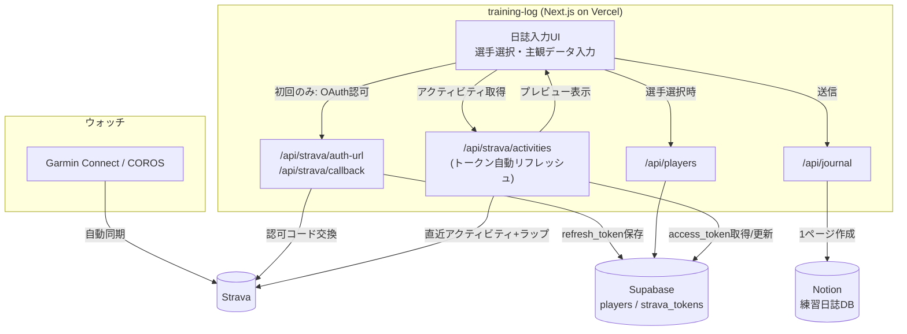

# 練習日誌 & Garmin/COROS(Strava)走行データ自動統合アプリ

陸上長距離チームの選手が、Garmin/COROS→Strava経由で自動同期される走行データ(距離・タイム・ペース・心拍・ラップ)を確認しながら、その日の主観データ(RPE・違和感・睡眠・体重・所感)を入力し、まとめて Notion データベースへ1レコードとして保存するスマホ最適化Webアプリです。

このリポジトリの他アプリ(`tiryou-karte` など)と同じく Next.js + Notion API 構成ですが、選手マスタと Strava の OAuth トークンだけは Supabase に保持します(日誌本文・走行データ自体は Notion 側の1箇所にまとめる方針)。

## 1. アーキテクチャ・データフロー



**運用フロー**

1. 選手は初回のみ「Stravaと連携する」ボタンから OAuth 認可し、`refresh_token` を Supabase に保存する(以後は自動更新されるため再認可不要)。
2. アプリを開き選手を選ぶと、`access_token` が(必要なら自動リフレッシュされた上で)直近のランニングアクティビティ(距離・タイム・平均ペース・平均心拍・先頭アクティビティのラップ)を取得してプレビュー表示する。
3. 選手は表示された走行データを確認しつつ、メニュー種別・RPE・疲労部位・睡眠時間・体重・所感を入力して送信する。
4. サーバー側 API が Strava のデータと主観データを結合し、Notion の練習日誌データベースに1ページとして保存する。

## 2. Notion データベース プロパティスキーマ

新規に「練習日誌」データベースを作成し、以下のプロパティを設定してください(型は Notion 上での設定値)。日本語のプロパティ名は `src/lib/notion.ts` のキーとそのまま対応しているため、変更する場合はコードも合わせて変更すること。

| プロパティ名 | 型 | 内容 |
| --- | --- | --- |
| 選手名 | タイトル | 選手の表示名(Supabaseの `players.name`) |
| 日付 | 日付 | 入力日(選手のローカル日付) |
| メニュー種別 | セレクト | 朝練Jog / 午後Jog / ペース走 / インターバル / 距離走 / 補強 / その他 |
| 走行距離(km) | 数値 | Stravaのアクティビティ距離(km、小数2桁) |
| 所要時間 | テキスト | `H:MM:SS` 形式(Stravaの moving_time) |
| 平均ペース | テキスト | `M'SS"/km` 形式 |
| 平均心拍 | 数値 | 平均心拍数(bpm) |
| RPE | 数値 | 自覚的運動強度(1〜10) |
| 違和感部位 | マルチセレクト | 右アキレス腱・左アキレス腱・右ハムストリング・左ハムストリング・右膝・左膝・腰・股関節・足底・なし・その他 |
| 睡眠時間 | 数値 | 前夜の睡眠時間(h) |
| 体重 | 数値 | 当日の体重(kg) |
| 日誌本文 | テキスト | 振り返り・所感 |
| Strava URL | URL | 該当アクティビティへのリンク |
| Strava Activity ID | テキスト | Stravaのアクティビティ内部ID(重複送信の突き合わせ用) |
| 部員 | リレーション(任意) | `tiryou-karte` の部員マスタDBと同じDBへのリレーション。`NOTION_MEMBERS_DATABASE_ID` を設定し、Supabaseの `players.notion_member_page_id` にページIDを入れている選手のみ自動で紐付く |

走行データなしで日誌だけ送信した場合、走行距離〜Strava関連のプロパティは空のまま保存されます。

## 3. Supabase テーブル設計

`supabase/schema.sql` を Supabase の SQL Editor で実行してください。

| テーブル | 用途 | 主なカラム |
| --- | --- | --- |
| `players` | 選手マスタ(表示名・部員マスタDBへの紐付け) | `id`, `name`, `notion_member_page_id`, `active` |
| `strava_tokens` | 選手ごとのStrava OAuthトークン(1選手1行) | `player_id`(PK/FK), `strava_athlete_id`, `access_token`, `refresh_token`, `expires_at`, `scope` |

両テーブルとも RLS を有効化しポリシーは定義していません。API ルート(サーバー専用の `service_role` キー)からのみアクセスできる想定です。選手の追加・編集は現状 Supabase のテーブルエディタから直接行ってください(件数が増えたら管理UIを追加検討)。

## 4. 実装したAPIルート

| ルート | 内容 |
| --- | --- |
| `GET /api/players` | Supabaseの選手一覧を返す |
| `GET /api/strava/auth-url?playerId=` | Strava OAuth認可URLを返す(`src/lib/strava.ts`) |
| `GET /api/strava/callback` | 認可コードをトークンに交換しSupabaseへ保存、アプリのトップへリダイレクト |
| `GET /api/strava/activities?playerId=` | `access_token`を(必要なら自動リフレッシュして)直近のランニングアクティビティ+先頭アクティビティのラップを返す |
| `POST /api/journal` | 主観データ+走行データをNotionへ1ページとして保存する(`src/lib/notion.ts`) |

いずれも `src/lib/` 配下の関数に処理を切り出しています。フロントエンドの実装は `src/app/page.tsx`(画面全体の状態管理)と `src/components/*`(選手選択・アクティビティプレビュー・RPEスライダー・部位タグ選択・日誌フォーム)です。

## 5. UIコンポーネントについて(shadcn/ui との関係)

依頼では shadcn/ui の利用を想定していましたが、このリポジトリの既存Next.jsアプリ(`tiryou-karte` 等)はいずれも shadcn/ui を導入せず Tailwind CSS を直書きするスタイルで統一されています。`npx shadcn@latest init` はインターネット経由でレジストリからコンポーネントを取得する構成上、この環境で導入すると保守方針が既存アプリと分岐してしまうため、今回は shadcn/ui 相当の見た目(カード・ボタン・スライダー・タグ選択など)を `src/components/` 配下に直接実装しました。将来的にチームとして shadcn/ui を採用する場合は、この `components/` の中身を shadcn 生成のプリミティブに差し替えても、呼び出し側(`page.tsx`)の構造はほぼそのまま流用できます。

## 6. セットアップ

```bash
cd apps/training-log
npm install
cp .env.local.example .env.local
# .env.local を実際の値で埋める
npm run dev
```

必要な環境変数は `.env.local.example` を参照してください。

1. **Notion**: インテグレーションを作成し `NOTION_TOKEN` を発行。上記スキーマで「練習日誌」DBを作成しIDを `NOTION_TRAINING_LOG_DATABASE_ID` に設定。インテグレーションをDBに接続するのを忘れないこと。
2. **Supabase**: プロジェクトを作成し `supabase/schema.sql` を実行。`SUPABASE_URL` / `SUPABASE_SERVICE_ROLE_KEY`(service_role)を設定。`players` テーブルに選手を登録。
3. **Strava**: https://www.strava.com/settings/api でアプリを作成し `STRAVA_CLIENT_ID` / `STRAVA_CLIENT_SECRET` を取得。「Authorization Callback Domain」にデプロイ先ドメインを登録。`STRAVA_REDIRECT_URI` はこのアプリの `/api/strava/callback` の絶対URL(1オリジン化後は `https://<ポータルのドメイン>/training-log/api/strava/callback`)。

## 7. デプロイ(Vercel)

他のNext.jsアプリと同様、Vercelプロジェクトの Root Directory を `apps/training-log` に設定してデプロイします。詳細な手順・vercel.json への追記方法はリポジトリルートの `scripts/README.md` を参照してください。デプロイ後は実際のURLを `apps-data.js` の `liveUrl` とルートの `vercel.json` の `rewrites` に反映してください(このコミット時点では未デプロイのため `liveUrl: null` のままにしています)。
